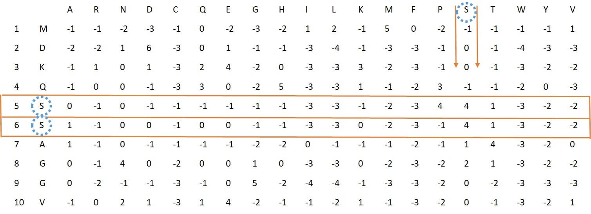

## 23 MBMGACPSSM
<font size="4">In this feature three different autocorrelation descriptors based on PSSM are adopted, which include: normalized Moreau-Broto autocorrelation, Moran autocorrelation and Geary autocorrelation
descriptors.Autocorrelation descriptor is a powerful statistical tool and defined based on the distribution of amino acid properties along the sequence, which measures the correlation between two
residues separated by a distance of d in terms of their evolution scores.</font>
#### Usage of this feature in PSSMCOOL package:
```
 w<-MBMGACPSSM(system.file("extdata", "C7GQS7.txt.pssm", package="PSSMCOOL"))
head(w, n = 50)
```
```
##  [1] 0.377 0.296 0.337 0.305 0.182 0.436 0.340 0.287 0.311 0.258 0.262 0.315
## [13] 0.278 0.319 0.238 0.385 0.275 0.179 0.218 0.281 0.153 0.093 0.142 0.110
## [25] 0.043 0.253 0.126 0.110 0.120 0.094 0.118 0.099 0.091 0.152 0.066 0.168
## [37] 0.084 0.039 0.050 0.093 0.151 0.097 0.121 0.091 0.047 0.243 0.124 0.102
## [49] 0.118 0.101
```
## 24 LPC-PSSM
<font size="4">This feature uses Linear predictive coding algorithm for each column of PSSM. So for
producing this feature vector "lpc" function from "phontools" R-package is used which produces a 14-dimensional vector for each column, since PSSM has 20 column eventually it will be obtained a 20*14=280 dimensional feature vector for each PSSM.</font> 
#### Usage of this feature in PSSMCOOL package:
```
 w<-LPC_PSSM(system.file("extdata", "C7GQS7.txt.pssm", package="PSSMCOOL"))
head(w, n = 50)
```
```
##  [1]  1.0000  0.9084  0.8390  0.5575  0.3737  0.4299  0.4070  0.4765  0.4369
## [10]  0.2830  0.3552  0.2212  0.1509  0.0496  1.0000  0.8380  0.7532  0.7463
## [19]  0.6135  0.3585  0.3674  0.2649  0.1610  0.2800  0.2347  0.2110  0.0763
## [28]  0.1057  1.0000  0.6738  0.6541  0.5619  0.5620  0.4152  0.4450  0.4506
## [37]  0.1943  0.1519  0.1683  0.0216 -0.1052  0.0215  1.0000  0.8553  0.8707
## [46]  0.6323  0.6506  0.7144  0.5384  0.5318
```

## 25 PSSM400
<font size="4">To generate this feature vector, for each of the standard amino acids, we find the positions containing that amino acid in the protein and separate the corresponding rows in the PSSM, to get a submatrix. Now, for the generated matrix, we calculate the average of its columns, and therefore, for each amino acid, a vector of length 20 is obtained. Finally, by putting these 20 vectors together, a feature vector of length 400 for each protein can be obtained. For example figure 16 shows the PSSM rows corresponding to amino acid S.</font>



#### Usage of this feature in PSSMCOOL package:
```
q<-pssm400(system.file("extdata","C7GQS7.txt.pssm",package="PSSMCOOL"))
head(q, n = 50)
```
```
##  [1] 3.5000 2.2778 2.1667 2.1667 2.1667 2.6111 2.2778 2.8333 2.5556 2.0556
## [11] 2.1111 2.3889 2.1111 2.2778 1.9444 2.7222 2.3333 1.5000 2.1111 2.1667
## [21] 1.0556 1.7778 1.1111 0.8333 1.0000 1.1111 0.8889 0.8333 1.2222 0.7778
## [31] 0.8889 1.1667 1.0000 0.7778 0.7222 1.1667 1.0556 0.5556 0.8889 0.7778
## [41] 3.3889 2.2222 3.6667 3.6667 1.7778 2.8889 2.8333 3.7778 2.4444 2.0556
```
## 26 PSSM-BLOCK
<font size="4"> In this feature at first PSSM is divided to Blocks based on Number N which user imports.
Then for each Block the mean of columns is computed to get 20-dimensional vector, eventually by
appending these vectors to each other final feature vector is obtained.</font> 

#### Usage of this feature in PSSMCOOL package:
```
as<-PSSMBLOCK(system.file("extdata", "C7GQS7.txt.pssm", package="PSSMCOOL"),5)
head(as, n = 50)
```
```
##  [1] 0.3773 0.2965 0.3371 0.3049 0.1816 0.4356 0.3395 0.2866 0.3109 0.2576
## [11] 0.2622 0.3150 0.2776 0.3187 0.2383 0.3846 0.2755 0.1791 0.2180 0.2808
## [21] 0.4032 0.2792 0.3606 0.2637 0.1736 0.5488 0.2988 0.3013 0.3996 0.2927
## [31] 0.3335 0.2389 0.3550 0.4466 0.2563 0.4349 0.2933 0.2153 0.2450 0.2929
## [41] 0.3530 0.3048 0.3146 0.3467 0.1921 0.3139 0.3719 0.2744 0.2156 0.2261
```

## 27 PSSM-SD
<font size="4">To generate this feature vector, at first for the column j, the sum of the total numbers in this column is calculated and denoted by . Then, starting from the first row of this column, the numbers are added one by one together to reach a number less than or equal to 25 percent of . Now the number of components used to calculate this sum is denoted by  and stored. Now, starting from the first row of this column again, the numbers are added one by one together to reach a number less than or equal to half of  (50%), then we show the number of components to calculate this sum with  and store it. In the same way for column j, starting from the last row of this column, we start adding each elements together to reach a number less than or equal to 25% of the number , and denote the number of these components by . In the next step, starting from the last row with summing of each element in this column to reach a number less than or equal to 50% of , the number  is also obtained. Therefore, 4 numbers are obtained for each column, and since the PSSM has 20 columns, for each protein a feature vector of length 80 is obtained. Figure 17 shows these steps schematically.</font>

#### Usage of this feature in PSSMCOOL package:
```
ww<-PSSM_SD(system.file("extdata", "C7GQS7.txt.pssm", package="PSSMCOOL"))
head(ww, n = 50)
```
```
## [[1]]
##      [,1] [,2] [,3] [,4] [,5] [,6] [,7] [,8] [,9] [,10] [,11] [,12] [,13] [,14]
## [1,]   54   23   15   13   31   10   14   22   18    44    52    16    62    77
## [2,]   70   57   70   32   46   13   54   66   89    71    79    32    84    94
## [3,]   88   83   90   88  104  121   87   86  110   107   108    63   109   116
## [4,]   71   57   70   32   46  110   54   66   89    72    79    32    84    97
##      [,15] [,16] [,17] [,18] [,19] [,20]
## [1,]    24    32    32    36    38    37
## [2,]    62    80    68    72    77    62
## [3,]   112   108    94    98   105    99
## [4,]    77    80    68    75    77    68
## 
## [[2]]
##  [1]  54  23  15  13  31  10  14  22  18  44  52  16  62  77  24  32  32  36  38
## [20]  37  70  57  70  32  46  13  54  66  89  71  79  32  84  94  62  80  68  72
## [39]  77  62  88  83  90  88 104 121  87  86 110 107 108  63 109 116 112 108  94
## [58]  98 105  99  71  57  70  32  46 110  54  66  89  72  79  32  84  97  77  80
## [77]  68  75  77  68
```


# 29 SOMA-PSSM
<font size="4"> This feature also considers each of the columns of the PSSM as a time series. If L represents the length of the protein, then the column j of the matrix can be thought of  as a time series. The SOMA algorithm is implemented in two steps using the following equations on the PSSM:
First, the moving average  for the time series  is calculated according to the following equation:</font>


<font size="4">Where n is the size of the moving average window, and if it tends to zero, the moving average will tend to original series, in other words: if  then . Next, for a moving average window size n which , the second-order difference of the time series  with respect to the moving average  is defined according to the following equation:</font>

![\sigma_{MA}^2=\frac{1}{L-n}\sum_{i=n}^L[y(i)-\overline{y_n}(i)]^2](https://latex.codecogs.com/svg.latex?%5Clarge%20%5Csigma_%7BMA%7D%5E2%3D%5Cfrac%7B1%7D%7BL-n%7D%5Csum_%7Bi%3Dn%7D%5EL%5By%28i%29-%5Coverline%7By_n%7D%28i%29%5D%5E2)

<font size="4"> The number n must be smaller than the length of the smallest protein in the database under study. In the paper used by this algorithm, the length of the smallest protein is 10 and therefore the number n will vary from 2 to 9, so according to above Equation, by putting the numbers  next to each other, 8 numbers are obtained for each column, and therefore the final feature vector will be of length 160.</font>

#### Usage of this feature in PSSMCOOL package:
```
 w<-SOMA_PSSM(system.file("extdata", "C7GQS7.txt.pssm", package="PSSMCOOL"))
head(w, n = 50)
```
```
##  [1] 0.2362 0.1898 0.2082 0.2175 0.1262 0.3151 0.2126 0.1880 0.2021 0.1703
## [11] 0.1830 0.1946 0.1593 0.2495 0.1656 0.2278 0.1300 0.1307 0.1247 0.1810
## [21] 0.7849 0.5708 0.7035 0.6571 0.3412 1.1477 0.6830 0.5934 0.6513 0.5323
## [31] 0.6020 0.5920 0.4988 0.8121 0.4674 0.7992 0.4326 0.3434 0.3525 0.5541
## [41] 1.6475 1.1293 1.4382 1.2852 0.6546 2.4681 1.3966 1.2121 1.3366 1.1003
```


# 28 PSSM-SEG
<font size="4"> This feature, similar to the previous feature, divides each column into four parts and calculates the values for each column. Then, using the following equations, it calculates the values of Segmented Auto Covariance Features. The final feature vector length will be of length 100.</font>


<font size="4">In the above equation,  represents the mean of column j in the PSSM and the number m is somehow a distance factor for each segment. Using the above equation, the feature of length 80 is obtained. Now the feature vector PSSM_AC is calculated using the previous factor m with length 20 and is added to the previous vector to get the final feature vector of length 100.</font>


<font size="4"> L Represents the total length of the protein. </font>
#### Usage of this feature in PSSMCOOL package:
```
q<-pssm_seg(system.file("extdata", "C7GQS7.txt.pssm", package="PSSMCOOL"),3)
head(q, n = 50)

```
```
##  [1]  0.0342  0.0306  0.0257  0.0307  0.0316  0.0238  0.0170  0.0238  0.0348
## [10]  0.0308  0.0219  0.0308  0.0706  0.0358  0.0275  0.0358  0.0343  0.0322
## [19] -0.0013  0.0322 -0.0070  0.0398  0.0602  0.0649  0.0691  0.0482  0.0426
## [28]  0.0482  0.0091  0.0332  0.0243  0.0332  0.0526  0.0400  0.0364  0.0400
## [37]  0.0931  0.0559  0.0311  0.0555  0.1182  0.0769  0.0584  0.0769  0.0283
## [46]  0.0371  0.0175  0.0371  0.0287  0.0242
```
